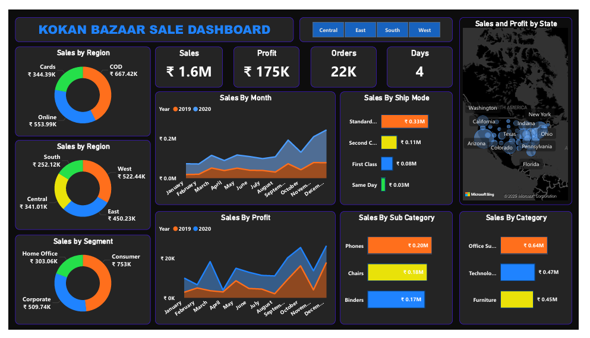

# 🛒 Kokan Bazaar Sales Dashboard

---

An interactive Power BI Sales Analytics Dashboard built to analyze retail performance, track profit trends, and generate actionable business insights from raw sales data.This project demonstrates how data can be transformed into meaningful visual stories to support smarter business decisions.

---

# 📌 Project Overview

---

The Kokan Bazaar Sales Dashboard helps understand:

✔ Sales performance across different regions

✔ Monthly revenue and profit trends

✔ Customer segment contribution

✔ Product category performance

✔ Shipping efficiency and order distribution

Instead of analyzing spreadsheets manually, this dashboard provides a visual decision-making tool for faster and clearer analysis.

---

# 🎯 Objective

---

The goal of this project is to:

1)Convert raw retail data into interactive insights

2)Identify top-performing regions and products

3)Track profitability and sales growth

4)Help businesses make data-driven decisions

5)Practice real-world Data Analyst workflow

---

# 🛠️ Tech Stack Used

---

📊 Power BI Desktop – Dashboard development and visualization

📂 Power Query – Data cleaning and transformation

🧠 DAX (Data Analysis Expressions) – Calculated KPIs and measures

📁 Microsoft Excel – Source dataset

📝 Data Modeling – Table relationships and filtering logic

🖼 PNG Export – Dashboard preview for documentation

---

# 📂 Data Source

---

The dataset is a retail sales dataset (Excel-based) containing:

1)Order-level transactional data

2)Regional sales distribution (Central, East, South, West)

3)Product categories & sub-categories

4)Customer segments (Consumer, Corporate, Home Office)

5)Shipping modes and delivery time

6)Monthly sales and profit records

7)This dataset simulates a real-world retail business scenario.

---

# 📊 Dashboard Features & Insights

---

***🔢 Key Performance Indicators (KPIs)***

---

Total Sales: ₹1.6M

Total Profit: ₹175K

Total Orders: 22K

Average Delivery Time: 4 Days

These KPIs give a quick snapshot of overall business health.

---

***🌍 Sales by Region**

---

Visual comparison of performance across: West,East,Central,South

➡ Helps identify high-performing markets.

---

***📅 Monthly Sales Trend**

---

A time-series analysis showing how sales change throughout the year.
➡ Useful for detecting seasonal growth patterns.

---

***🚚 Sales by Shipping Mode***

---

Analyzes logistics performance:

1)Standard Class dominates usage

2)Helps optimize delivery strategy

---

***🛍 Sales by Category***

---

Top-performing categories include: Office Supplies,Technology,Furniture

➡ Shows where revenue is generated the most.

---

**📦 Sales by Sub-Category***

---

Highlights strong-performing products: Phones,Chairs,Binders.

➡ Helps in inventory planning.

---

***👥 Sales by Customer Segment**

---

Revenue contribution by: Consumer,Corporate,Home Office

➡ Identifies target customer base.

---

***🗺 Geographic Sales Distribution**

---

Map visualization to track state-wise sales performance.
➡ Helps understand location-based demand.

---

# 💡 Business Insights Derived

---

✔ West region contributes the highest revenue

✔ Consumer segment drives maximum sales

✔ Office Supplies category dominates order volume

✔ Standard shipping is most operationally efficient

✔ Sales show strong growth toward year-end

---

# 📷 Dashboard Preview

---

